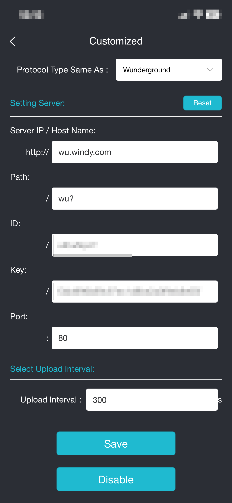

## Prerequisites

* **Set up your Froggit weather station and connect it to the internet** - follow the user documentation that came with your station.
* **Access your station settings** - the simplest option is to use the Ecowitt mobile application.

## Steps

The exact configuration options may vary depending on your station model or firmware version.

1. Open the Ecowitt application and select your weather station.
2. Navigate to **Device Settings -> Others -> DIY Upload Servers**.
3. Select **Customized**.
4. Set **Customized** to **Enable**.
5. Fill in the following fields:

   * **Protocol Type Same As**: `Wunderground`
   * **Server IP / Hostname**: `wu.windy.com`
   * **Path**: `/wu?` (include the final `?` exactly as shown). If your station does not accept the leading `/`, try `wu?` instead.
   * **Station ID**: enter the *Station ID* of your station.
   * **Station Key**: enter the *Station Password* of your station.
   * **Port**: `80` for HTTP, or `443` if your station supports HTTPS.
   * **Upload Interval**: `300` means 5 minutes. Do not send data more often than once every 5 minutes; otherwise, your requests will be blocked by the rate limiter. You can use a longer interval if needed.
6. Save your changes by clicking the **Save** button.

You can find your *Station ID* and *Station Password* on the station detail page in Windy Stations: **My Stations -> station -> Connection**.

After saving, your station should start sending data automatically. The first update may take a while - in some cases, up to an hour before the station becomes active and starts showing live measurements on Windy.
